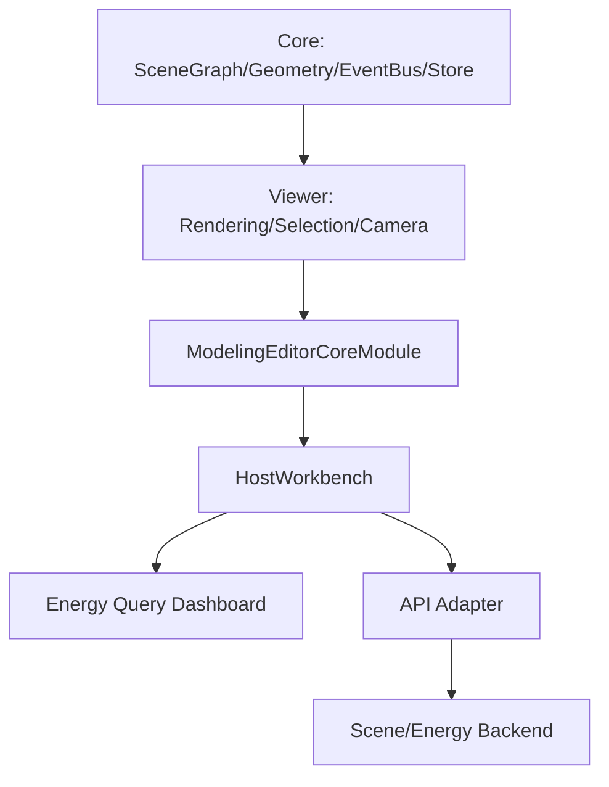

# 三维建模模块技术汇报（评审版）

## 摘要
本项目围绕“工程级三维建模能力在业务宿主中的可持续落地”展开，构建了一个可插拔、可扩展、可演进的3D建模技术体系。技术路线采用内核稳定化与业务解耦并行推进：底层以 SceneGraph 作为统一数据语义，以事件总线与多层状态管理支撑高频交互，以几何系统与空间索引提升建模可计算性；上层以宿主桥接接口实现业务快速编排，使能耗查询、驾驶舱分析等业务能力在不侵入建模内核的前提下完成深度联动。该体系本质上不是单一页面开发，而是一个跨渲染、交互、数据、架构治理的综合技术实现。

关键词：三维建模，SceneGraph，R3F，Three.js，事件驱动，空间索引，宿主解耦，工程化架构

## 1. 研究背景与问题定义
在复杂建筑场景中，三维建模系统常见三类工程痛点：

1. 业务耦合导致内核难维护，新增功能需要反复改底层。
2. 建模状态与业务状态分离不清，跨模块联动不可控。
3. 高密度交互下，渲染、选择、聚焦、筛选等链路容易产生一致性问题。

本项目的目标是构建一套可在真实业务环境中持续演化的3D建模模块，核心要求包括：

1. 内核能力稳定，支持长期迭代。
2. 宿主业务可快速挂载，不破坏建模边界。
3. 支持从“编辑模式”到“驾驶舱查询模式”的统一工作台切换。

## 2. 总体技术架构
系统采用“核心能力层 + 宿主编排层 + 业务模块层”的三层架构：

架构设计要点：

1. 核心层负责建模语义与可计算能力，不承担业务页面职责。
2. 宿主层负责装配、状态桥接、权限模式切换。
3. 业务层专注查询分析与可视化，不直接写入内核细节。

该架构使“3D引擎能力”与“行业业务能力”形成低耦合协同关系。

## 3. 核心技术路线

### 3.1 数据语义中心：SceneGraph 驱动
系统以 SceneGraph 作为统一建模数据结构，承载建筑、楼层、房间、墙体、门窗、构件等节点关系。该设计将几何对象从“渲染对象”提升为“可计算对象”，实现以下能力：

1. 层级化管理：天然支持楼层/房间/构件分治。
2. 跨模块一致语义：建模、查询、可视化消费同一主键体系。
3. 可序列化持久化：场景可直接加载与保存，支持项目级版本流转。

### 3.2 几何系统与空间计算
核心包中将建筑要素拆分为多种系统化能力（Wall、Door、Window、Slab、Roof、Stair 等），并结合空间计算函数实现几何关系推导。其价值在于：

1. 由“手工摆放”升级到“规则驱动构造”。
2. 支撑空间检测、边界处理、层级推断等高级建模动作。
3. 为后续自动建模、智能校验打下可计算基础。

### 3.3 事件驱动与跨层通信
系统通过事件总线实现跨层通信（如 camera-controls:focus），避免组件间硬耦合调用。其工程意义：

1. 业务层可触发3D相机聚焦而不依赖 Viewer 内部实现。
2. 建模层可独立演化事件语义，宿主层仅消费契约。
3. 联动链路清晰，便于问题定位与能力扩展。

### 3.4 多层状态管理与一致性控制
项目使用分层状态管理策略：

1. 场景状态：负责节点与编辑语义。
2. Viewer 状态：负责选择、悬停、层级显示、相机上下文。
3. 宿主状态：负责筛选、查询提交态、业务面板状态。

通过状态分层，系统可在“编辑态”和“只读态”之间平滑切换，确保行为权限、UI入口和底层写入能力保持一致。

### 3.5 渲染与交互栈
渲染层采用 Three.js + React Three Fiber 的组合，兼顾底层控制力与组件化开发效率。该路线的优势：

1. Three.js 保证图形能力与生态兼容。
2. R3F 提供声明式渲染与React生态集成。
3. 与建模状态天然对接，便于复杂交互编排。

### 3.6 宿主桥接协议化
ModelingEditorCoreModule 暴露 onLoad、onSave、onSelectionChange、onSaveStatusChange 等桥接回调，形成宿主集成协议。通过协议化接口，系统实现：

1. 建模模块独立发布与接入。
2. 业务系统按需注入数据源与流程控制。
3. 场景编辑、查询联动、状态提示在同一工作台协同运行。

## 4. 高级联动机制设计

### 4.1 筛选到三维视图的语义映射
在宿主层中，筛选条件并非仅用于列表过滤，而是直接映射为3D视图语义：

1. 选择房间时，自动同步 zone 选择态并触发相机聚焦。
2. 选择楼层时，切换到单层显示模式。
3. 清空筛选时，恢复堆叠视图。

这种“筛选即视图”的机制显著提升了复杂场景导航效率。

### 4.2 业务图表回写3D场景
在能耗驾驶舱中，图表点击动作可回写到3D场景聚焦链路，形成“分析-定位-处置”的闭环流程：

1. 图表中定位高风险楼层。
2. 一键聚焦至3D空间对象。
3. 进入编辑或复核动作。

该机制将传统静态报表升级为可执行的空间分析界面。

## 5. 工程复杂度与工作量说明
该模块工作量并非体现在单页面元素数量，而体现在跨层系统工程整合，主要包括：

1. 构建可维护的三维建模语义体系（节点、层级、系统、事件）。
2. 打通渲染层与业务层的双向联动协议。
3. 实现编辑态/只读态/驾驶舱态的统一工作台架构。
4. 建立真实接口优先、Mock兜底的数据韧性机制。
5. 将图表分析行为与3D空间定位能力闭环化。

从技术特征看，该工作属于“平台化建模能力构建 + 行业应用落地”的复合型研发，而非单点前端开发。

## 6. 技术先进性总结
本项目在先进性上体现为以下五点：

1. 采用 SceneGraph 统一建模语义，实现可计算三维编辑架构。
2. 采用事件驱动解耦，形成跨层协同而非跨层依赖。
3. 采用分层状态体系，保障高频交互下的一致性与可维护性。
4. 采用宿主协议化接入，使建模能力具备平台级复用价值。
5. 形成“3D建模 + 业务分析 + 空间定位”的一体化闭环能力。

## 7. 结论与评审价值
本项目完成的不仅是一个3D界面，而是一套可持续演进的三维建模技术底座。其核心贡献在于：

1. 建立了可长期迭代的建模内核与宿主协同范式。
2. 将复杂业务分析能力与三维空间交互深度融合。
3. 具备向更多垂直场景复制的工程可迁移性。

因此，该工作在技术深度、架构完整性和工程落地价值上均达到较高水平，具备明显的平台化与产业化潜力。

## 附录：评审答辩可直接使用的要点

1. 本项目的核心不是“做了多少图表”，而是“构建了一个业务可插拔的3D建模平台”。
2. 关键创新是“SceneGraph语义中心 + 事件驱动解耦 + 宿主协议化接入”。
3. 能耗页面只是示范场景，底座能力可复用到巡检、运维、资产、安防等模块。
4. 技术价值在于形成了跨建模、渲染、数据、交互的系统工程闭环。
