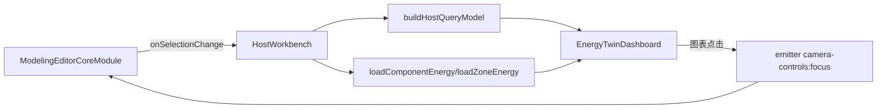

# 3D建模与能耗查询页面技术交接文档

## 1. 文档定位
本文件用于将我在本项目中负责的两块工作完整交接给后续开发者：

1. 3D建模工作台（Host + ModelingEditorCoreModule）
2. 能耗查询驾驶舱页面（Energy Twin Dashboard）

目标是让接手同学在不深入所有历史提交的前提下，能够快速理解技术路线、关键实现、边界约束和扩展方式。

## 2. 我的职责范围（交接口径）

### 2.1 业务职责
1. 负责3D建模能力在宿主页面中的装配与联动。
2. 负责能耗查询页面（筛选、查询、图表、智能问答）功能实现。
3. 负责3D选中状态与能耗结果的桥接逻辑。

### 2.2 代码范围
1. 宿主工作台与建模模块装配：apps/editor/features/host-shell/components/host-workbench.tsx
2. 能耗驾驶舱主页面：apps/editor/features/energy-insights/components/energy-twin-dashboard.tsx
3. 能耗数据访问层：apps/editor/features/energy-insights/lib/energy-api.ts
4. 查询模型层：apps/editor/features/energy-insights/lib/host-query.ts
5. 筛选栏组件：apps/editor/features/energy-insights/components/host-filter-bar.tsx
6. 智能助手组件：apps/editor/features/energy-insights/components/energy-assistant-chat.tsx

## 3. 技术路线总览

### 3.1 核心思路
采用“建模内核稳定 + 宿主业务扩展”的路线：

1. 建模内核通过 ModelingEditorCoreModule 对宿主暴露标准回调（加载、保存、选中变化）。
2. 能耗业务全部放在 apps/editor/features/energy-insights，避免反向侵入编辑器内核包。
3. 业务查询先走本地可预测模型（host-query）保证可演示，再通过 energy-api 无缝切到后端真实接口。

### 3.2 技术栈（本交接范围）
1. React 19 + Next.js App Router（宿主页面）
2. @pascal-app/core / @pascal-app/viewer / @pascal-app/editor（建模与3D交互）
3. ECharts + echarts-for-react（驾驶舱图表）
4. TypeScript（类型约束）
5. Tailwind CSS（页面样式）

## 4. 架构关系（重点）

说明：
1. HostWorkbench 是连接建模与业务的桥。
2. EnergyTwinDashboard 是纯展示与交互层，不直接管理3D底层状态。
3. 3D聚焦通过 emitter 事件总线回流到 Viewer。

## 5. 3D建模技术路线（交接重点）

### 5.1 宿主挂载方式
在 HostWorkbench 中挂载 ModelingEditorCoreModule，使用以下能力：

1. onLoad：加载项目场景
2. onSave：保存项目场景
3. onSelectionChange：监听当前选中节点
4. onSaveStatusChange：同步保存状态到业务UI

设计价值：
1. 建模功能与业务逻辑隔离
2. 支持未来替换业务面板而不改建模模块

### 5.2 筛选与3D状态同步
HostWorkbench 内实现了筛选条件对 Viewer 状态的联动：

1. 当选择房间（zoneId）时：
   - 设置 viewer.selection.zoneId
   - 设置 levelMode 为 solo
   - 触发 camera-controls:focus 对当前房间聚焦
2. 当仅选择楼层（levelId）时：
   - 设置 viewer.selection.levelId
   - 维持楼层隔离显示
3. 当无楼层/房间筛选时：
   - 清空 selection 中的 level/zone
   - 恢复 stacked 模式

该策略保证了“筛选即视角语义”的体验一致性。

### 5.3 编辑态与只读态切换
通过 editEnabled 控制 useScene.readOnly，并同步 viewerOverlayOptions：

1. 编辑态：显示动作菜单、浮动菜单、面板管理
2. 只读态：保留查看能力，禁止编辑入口

这部分是把“看板模式”与“编辑模式”统一在同一工作台中的关键实现。

## 6. 能耗查询页面实现（交接重点）

### 6.1 页面组成
EnergyTwinDashboard 采用双侧驾驶舱布局：

1. 顶部：筛选条（HostFilterBar）+ 项目信息 + 视图模式切换
2. 左栏：KPI、负荷结构、楼层排行、异常事件、趋势、散点
3. 右栏：告警漏斗、SLA看板、健康矩阵、Sankey流向、前后对比
4. 右下：智能助手开关（EnergyAssistantChat）

### 6.2 查询策略
采用“草稿筛选 + 提交筛选”双状态设计：

1. draftFilters：实时编辑中
2. appliedFilters：点击“开始查询”后生效
3. hasQueried：控制是否展示查询结果

优点：
1. 避免用户每次改筛选都触发查询
2. 有利于后续接入真实后端分页/聚合查询

### 6.3 查询模型（host-query）
buildHostQueryModel 的职责：

1. 从当前场景节点提取楼层与房间候选项
2. 生成可筛选结果集（HostQueryResult[]）
3. 根据 timeRange、energyLevel、keyword 进行过滤与排序

当前为演示模型（含可复现随机种子），便于离线联调与演示。

### 6.4 能耗数据访问（energy-api）
energy-api 实现“真实接口优先 + Mock兜底”的容错策略：

1. 未配置 baseUrl：直接返回 Mock 数据
2. 接口 404：返回 Mock 数据，页面不中断
3. 接口异常：抛出错误，由页面统一展示
4. 字段缺失（hvacUsage/waterUsage）：自动补齐

这让页面在接口未完全联通时仍可用。

### 6.5 3D与能耗联动
联动规则：

1. onSelectionChange 输出 selectedComponentId
2. 若选中 zone：调用 loadZoneEnergy
3. 若选中普通构件：调用 loadComponentEnergy
4. 同时尝试反查构件对应 zone 再补拉 zone 能耗

图表回写3D：
1. 在“楼层热力排行”柱状图点击后，触发 emitter.emit('camera-controls:focus') 进行场景聚焦。

## 7. 页面中的关键技术实现

### 7.1 图表方案
使用 ReactECharts 封装多种图表类型，包含：

1. 线图（趋势）
2. 环图（负荷结构）
3. 横向柱图（楼层排行）
4. 漏斗图（告警）
5. 散点图（温度-负荷）
6. 热力图（健康矩阵）
7. Sankey（能耗流向）
8. 双柱对比图（异常前后）

### 7.2 布局与遮挡处理
通过 CSS 变量 --host-editor-panel-avoid-right 动态通知编辑面板避让区域：

1. 驾驶舱右侧图表轨道占位时设置偏移
2. 智能助手展开时扩大偏移
3. 组件卸载时重置偏移

此机制用于避免右侧业务层与编辑器面板互相遮挡。

### 7.3 智能助手容错
EnergyAssistantChat 优先调用 /api/agent-chat，失败时使用本地 buildEnergyAssistantReply 兜底，保证问答入口可持续可用。

## 8. 接口契约（接手必须知道）

### 8.1 前端到后端
1. GET /projects/:projectId/energy/components/:componentId
2. GET /projects/:projectId/energy/zones/:zoneId
3. GET /projects/:projectId/scene
4. PUT /projects/:projectId/scene

### 8.2 关键类型
1. HostQueryFilters
2. HostQueryResult
3. EnergyApiResponse
4. ZoneEnergyResponse
5. ModelingSelectionSnapshot

建议：后续若调整字段，优先在 lib 层做适配，不直接改组件层消费结构。

## 9. 交接后的扩展建议

### 9.1 能耗侧
1. 将 buildHostQueryModel 替换为真实批量查询接口。
2. 为查询引入分页、排序和服务端聚合。
3. 增加缓存层，降低重复请求。

### 9.2 3D侧
1. 为筛选联动补充统一的 viewport API（避免跨组件直接操作 viewer store）。
2. 把焦点事件从字符串事件名升级为可类型化事件常量。
3. 为模式切换（编辑/只读）补自动化回归用例。

### 9.3 页面侧
1. 图表配置抽象为配置工厂，避免大组件持续膨胀。
2. 引入数据健康指标（缺失率、延迟）到状态提示区。
3. 智能问答增加可追溯引用（回答来源于哪个构件/时间区间）。

## 10. 快速上手清单（接手执行）

1. 先看 HostWorkbench，理解状态源头与联动链路。
2. 再看 host-query 与 energy-api，理解数据从何而来。
3. 最后看 EnergyTwinDashboard，理解展示与交互。
4. 若要改功能，优先改 lib（模型/接口），其次改组件展示。
5. 避免把业务逻辑回灌到建模内核包。

## 11. 相关代码索引
1. apps/editor/features/host-shell/components/host-workbench.tsx
2. apps/editor/features/energy-insights/components/energy-twin-dashboard.tsx
3. apps/editor/features/energy-insights/lib/host-query.ts
4. apps/editor/features/energy-insights/lib/energy-api.ts
5. apps/editor/features/energy-insights/components/host-filter-bar.tsx
6. apps/editor/features/energy-insights/components/energy-assistant-chat.tsx
7. apps/editor/前端接口说明.md

---
如需继续深化交接，可在下一版补充：
1. 时序图（selection -> query -> chart -> focus）
2. 常见故障排查手册（接口404、数据为空、筛选无结果）
3. 发布前检查清单（交互、性能、类型、样式遮挡）
